# MML(AddmusicK) Toolkit

This extension provides features to help you edit MML for AddmusicK.

## Features

### Initialization

If you want to use this extension for the first time, you need to set the AddmusicK path in the config. At the first startup, the following warning message will appear.

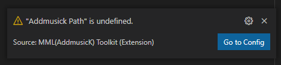

You can set the path of AddmusicK by clicking the "Go to Config" button.

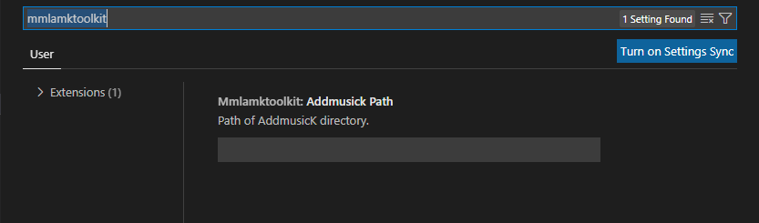

This setting is used for referencing the sample file (.brr).

### Syntax Highlight

Improve the readability of your MML by highlighting.

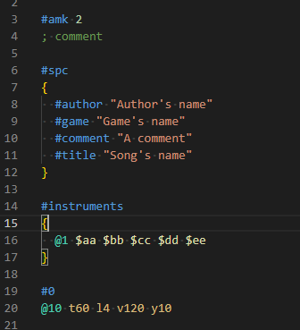

### Semantic Highlight (Only Dark+ theme)

Highlight Replacements that cannot be supported by Syntax Highlight, highlight the beginning of the Hex command, and color-coding by octave.

Compare the following two images :

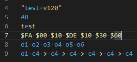 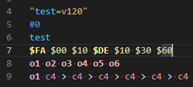

### Diagnostics

Diagnostics is displayed for descriptions in which AddmusicK produces an error (e.g., if the value is empty or the limit is exceeded).

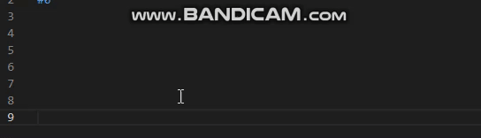

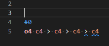

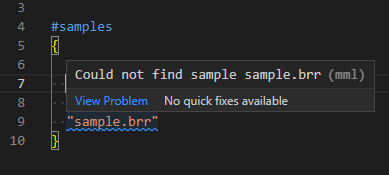

### Auto Completion

To assist with input, display completions such as Hex command and Special command.

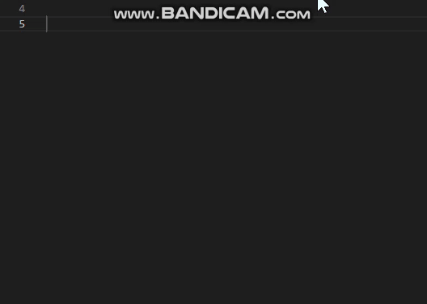

### Hover

Displays information about the command on mouse hover. (From AddmusicK Readme)

Some commands display the current instrument, octave, and contents of loops, etc.

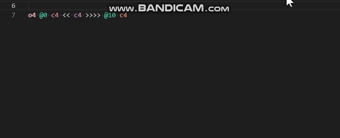

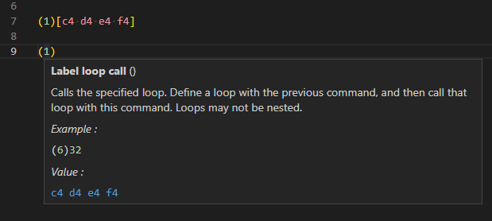

---

See [Feature List](FEATURELIST.md) to see all features.

## Planned Features

- Some useful commands (formatting of MML generated by PetiteMM, drum assignments, etc.)
